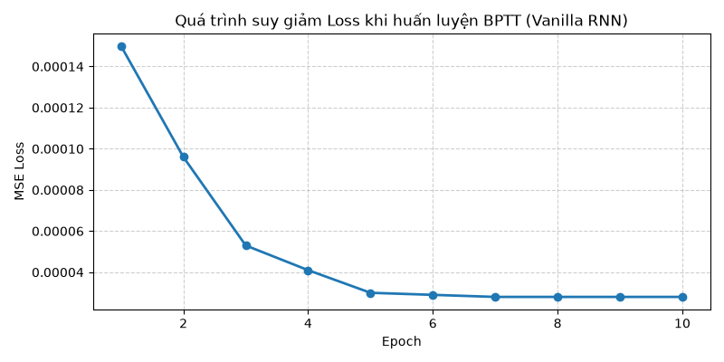

# Vanilla RNN: Từ Lý Thuyết Tới Thực Hành
**Quá trình Training, Forward, Backpropagation & Triệt tiêu đạo hàm**
Cài đặt bằng NumPy

---

## 1. Kiến trúc mạng Vanilla RNN

Một cell Vanilla RNN duy trì một 'trạng thái ẩn' (hidden state) $h_t$ qua từng bước thời gian $t$.

**Các tham số cần huấn luyện:**
- **$W$**: Trọng số chuyển đổi Input ($x_t$) vào Hidden state.
- **$U$**: Trọng số chuyển đổi Hidden state cũ ($h_{t-1}$) sang Hidden state mới ($h_t$).
- **$V$**: Trọng số chuyển đổi Hidden state ($h_t$) thành Output ($y_t$).
- **$b_h, b_y$**: Bias cho Hidden state và Output.

---

## Khởi tạo mô hình (NumPy)

```python
class VanillaRNN:
    def __init__(self, input_size, hidden_size, output_size):
        # W: input -> hidden
        self.W = np.random.randn(hidden_size, input_size) * np.sqrt(2.0 / (input_size + hidden_size))
        # U: hidden -> hidden
        self.U = np.random.randn(hidden_size, hidden_size) * np.sqrt(1.0 / hidden_size)
        # V: hidden -> output
        self.V = np.random.randn(output_size, hidden_size) * np.sqrt(2.0 / (hidden_size + output_size))
        
        self.b_h = np.zeros((hidden_size, 1))
        self.b_y = np.zeros((output_size, 1))
```

---

## 2. Lan truyền xuôi (Forward Pass)

Lan truyền xuôi truyền một chuỗi đầu vào qua mạng RNN. Ở mỗi bước $t$:

1. **Cập nhật trạng thái ẩn (Hidden State)**:
   $h_t = \tanh(U h_{t-1} + W x_t + b_h)$
   *Hàm $\tanh$ giúp nén các giá trị vào khoảng $[-1, 1]$.*

2. **Tính toán đầu ra dự đoán (Output)**:
   $\hat{y}_t = V h_t + b_y$

3. **Lưu trữ Caches**:
   Lưu lại $x_t, h_t$ để dùng cho Backpropagation.

---

## Code Lan truyền xuôi (NumPy)

```python
def forward(self, x_seq):
    h_states = {}
    h_states[-1] = np.zeros((self.hidden_dim, 1))
    
    for t in range(len(x_seq)):
        x_t = np.array(x_seq[t]).reshape(-1, 1)
        
        a_t = np.dot(self.W, x_t) + np.dot(self.U, h_states[t-1]) + self.b_h
        h_t = np.tanh(a_t)
        h_states[t] = h_t
    
    # Dự đoán đầu ra ở bước thời gian cuối cùng
    y_pred = np.dot(self.V, h_states[len(x_seq)-1]) + self.b_y
    return y_pred, h_states
```

---

## 3. BPTT - Hàm mất mát

**Lan truyền ngược qua thời gian (Backpropagation Through Time)**
Tính đạo hàm Loss theo từng trọng số bằng Chain Rule.

1. **Hàm mất mát MSE**: 
   $$L = \frac{1}{2} (\hat{y} - y_{true})^2$$ 
   
2. **Đạo hàm của hàm mất mát**:
   $$\frac{\partial L}{\partial \hat{y}} = \hat{y} - y_{true}$$

---

## 3. BPTT - Gradient Output

Gradient tại lớp Output truyền ngược về các trọng số và lớp ẩn:

- **Đạo hàm theo ma trận trọng số $V$**:
   $$dV = \frac{\partial L}{\partial \hat{y}} \cdot h_T^T$$
   
- **Đạo hàm theo bias $b_y$**:
   $$db_y = \frac{\partial L}{\partial \hat{y}}$$
   
- **Gradient truyền ngược về Hidden state cuối cùng ($h_T$)**:
   $$dh_T = V^T \cdot \frac{\partial L}{\partial \hat{y}}$$

---

## BPTT - Qua các Time-Step

**Từ $t = T$ về $t = 1$:**

Đạo hàm của $\tanh(a_t)$ là $1 - h_t^2$. Tại mỗi bước thời gian $t$:

1. **Gradient tại $a_t$**: $dh_{raw} = dh_t \odot (1 - h_t^2)$
2. **Tích lũy Gradient**:
   - $dW += dh_{raw} \cdot x_t^T$
   - $dU += dh_{raw} \cdot h_{t-1}^T$
   - $db_h += dh_{raw}$
3. **Lan truyền gradient ngược**:
   - $dh_{t-1} = U^T \cdot dh_{raw}$

---

## Code BPTT (Phần 1)

```python
def backward(self, x_seq, y_true, y_pred, h_states):
    dW, dU, dV = np.zeros_like(self.W), np.zeros_like(self.U), np.zeros_like(self.V)
    db_h, db_y = np.zeros_like(self.b_h), np.zeros_like(self.b_y)
    
    dy = y_pred - y_true
    T = len(x_seq)
    h_T = h_states[T - 1].reshape(-1, 1)
    
    # Gradient cho V và b_y
    dV = np.dot(dy, h_T.T)
    db_y = dy.reshape(self.b_y.shape)
    
    # Gradient ban đầu truyền ngược vào hidden state cuối cùng (h_T)
    dh_next = np.dot(self.V.T, dy)
```

---

## Code BPTT (Phần 2)

```python
    # Vòng lặp BPTT từ T-1 về 0
    for t in reversed(range(T)):
        h_t = h_states[t].reshape(-1, 1)
        dh_raw = (1.0 - h_t**2) * dh_next
        x_t = np.array(x_seq[t]).reshape(-1, 1)
        h_prev = h_states[t-1].reshape(-1, 1) if t > 0 else np.zeros((self.hidden_dim, 1))
        
        # Tích lũy Gradient
        dW += np.dot(dh_raw, x_t.T)
        dU += np.dot(dh_raw, h_prev.T)
        db_h += dh_raw.reshape(self.b_h.shape)
        
        # Lan truyền gradient ngược tiếp về bước t-1
        dh_next = np.dot(self.U.T, dh_raw)
        
    return dW, dU, dV, db_h, db_y
```

---

## 4. Triệt tiêu đạo hàm (Vanishing Gradient)

- Khi mở rộng chuỗi qua nhiều bước thời gian, gradient truyền ngược $dh_{t-k}$ là tích của chuỗi các ma trận $U^T$ và $(1 - h^2)$.
- Do giá trị $(1 - h^2) \le 1$ và nếu trị riêng của $U$ nhỏ, qua phép nhân lặp liên tiếp, gradient sẽ tiến dần về 0 theo hàm số mũ khi khoảng cách thời gian $k$ lớn.
- **Hậu quả**: Vanilla RNN không học được các phụ thuộc dài hạn.
- **Giải pháp**: 
  - *Gradient Clipping* (chống bùng nổ gradient).
  - Sử dụng kiến trúc *LSTM* hoặc *GRU*.

---

## 5. Quá trình Huấn luyện (Training Loop)

**Quy trình tại mỗi Epoch:**

1. Duyệt qua từng chuỗi (sequence) trong tập Train.
2. Thực hiện **Forward Pass** lấy dự đoán $\hat{y}$.
3. Tính **Loss (MSE)**.
4. Thực hiện **Backward Pass (BPTT)** để tính Gradients ($dW, dU, dV$).
5. **Cập nhật Trọng số** (Update Weights) bằng thuật toán SGD:
   $W = W - \text{learning\_rate} \times dW$

---

## Code Huấn luyện Từng bước

```python
for epoch in range(1, epochs + 1):
    epoch_loss = 0.0
    for i in range(num_samples):
        x_seq = X_train[i]
        y_true = np.array(y_train[i]).reshape(-1, 1)
        
        # 1. Forward pass
        y_pred, h_states = model.forward(x_seq)
        
        # 2. Tính MSE Loss
        loss = 0.5 * (float(y_pred[0, 0] - y_true[0, 0]) ** 2)
        epoch_loss += loss
        
        # 3. Backward pass (BPTT)
        grads = model.backward(x_seq, y_true, y_pred, h_states)
        
        # 4. Cập nhật trọng số theo gradient descent
        model.update_weights(*grads, lr=0.005)
```

---

## 6. Kết quả Huấn luyện



